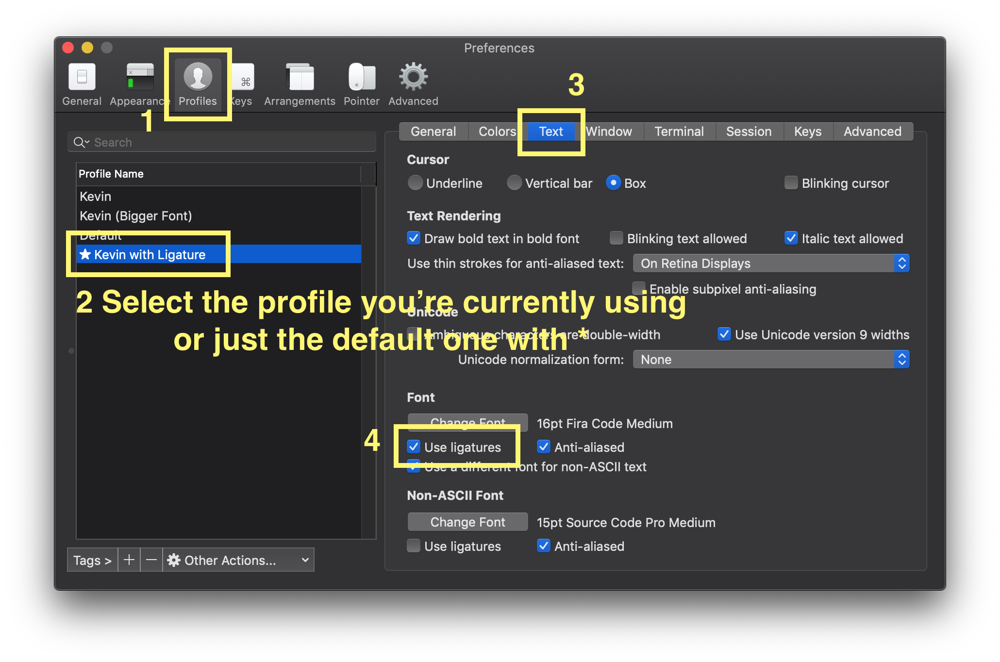

# Installation

## For Ubuntu Linux
```shell
sudo apt-get update && sudo apt-get install zsh 
```

Install oh-my-zsh from https://github.com/ohmyzsh/ohmyzsh 

* Using curl

```shell
sh -c "$(curl -fsSL https://raw.githubusercontent.com/ohmyzsh/ohmyzsh/master/tools/install.sh)" 
```
OR

* Using wget

```shell
sh -c "$(wget -O- https://raw.githubusercontent.com/ohmyzsh/ohmyzsh/master/tools/install.sh)" 
```

Change the default shell to z-shell

```shell
chsh -s /bin/zsh 
```

## For Mac OSX

```shell
brew update 
brew install zsh
```

Install oh-my-zsh from https://github.com/ohmyzsh/ohmyzsh 

* Using curl

```shell
sh -c "$(curl -fsSL https://raw.githubusercontent.com/ohmyzsh/ohmyzsh/master/tools/install.sh)" 
```
OR

* Using wget

```shell
sh -c "$(wget -O- https://raw.githubusercontent.com/ohmyzsh/ohmyzsh/master/tools/install.sh)" 
```

Change the default shell to z-shell

```shell
# You don't need it for the new macOS
chsh -s /usr/local/bin/zsh 
```


## Install Powerline Fonts for `agnoster` theme
**It is not necessary for Server**

```shell
cd to/wherever/you/like 
git clone https://github.com/powerline/fonts powerline-fonts 
cd powerline-fonts 
./install.sh 
```

* Open `~/.zshrc` and change (**Do only this on Server**)

```shell
ZSH_THEME="robbyrussell"
```
to

```shell
ZSH_THEME="agnoster"
```

* Now, you need to change the terminal font to one of powerline ones.

e.g.) Mac OS X


## FiraCode
I also recommend [FiraCode](https://github.com/tonsky/FiraCode) font, which supports ligatures. Both macOS's Terminal and iTerm2 support ligatures. 

In iTerm2, Open `Preferences` (Cmd+,)
1. `Profiles` tab
2. Select the profile you're using (or just the default one with `*`)
3. Move to the `Text` tab
4. Check the `Use ligatures` option




## Install `zsh-syntax-highlighting` plugin

```shell
cd ~/.oh-my-zsh/custom/plugins 
git clone git://github.com/zsh-users/zsh-syntax-highlighting.git 
```

* Open `~/.zshrc` and change

```shell
plugins=(git)
```
to

```shell
plugins=(git zsh-syntax-highlighting)
```
